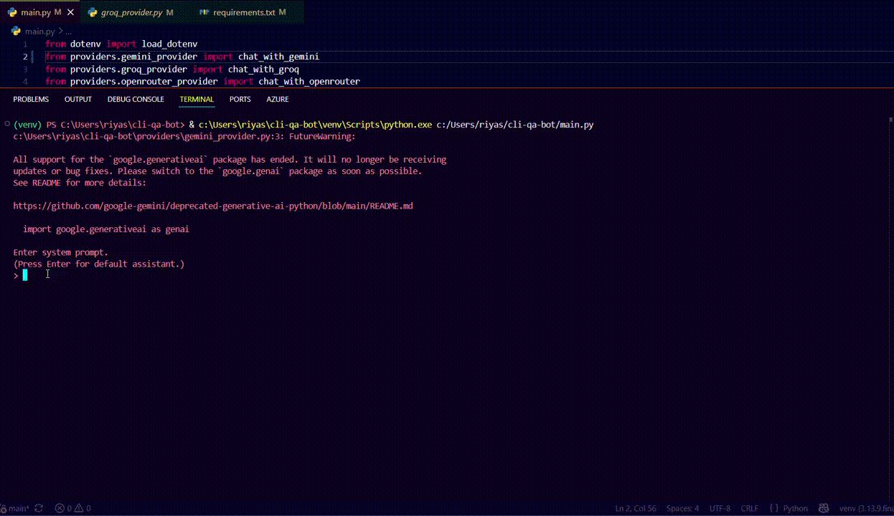
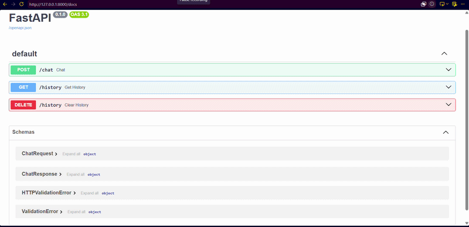

# CLI Multi-Provider AI Chatbot + FastAPI Backend

> A multi-provider AI chatbot built in two phases — first as a CLI application, then evolved into a REST API backend. Supports Groq, Gemini, and OpenRouter through one unified interface, with conversation memory, structured JSON output, pytest-based test coverage, and Swagger UI documentation.

---

## What This Is

Most beginner chatbot projects hardcode a single API call and stop there. This one is built around a harder, more useful question: what happens when you need to support more than one LLM provider, and they don't agree on how to do anything?

Groq follows the OpenAI-compatible message format. Gemini doesn't. Each has different SDKs, different ways of handling conversation history, different error behavior, and different quota systems. This project builds a common interface across all three — so the application layer never needs to know which provider is actually answering.

The project grew in two phases:

- **Phase 1 — CLI:** Interactive terminal chatbot with memory, system prompts, JSON mode, and provider switching
- **Phase 2 — FastAPI:** The same business logic wrapped in a REST API, without rewriting the provider layer

---

## The Problem

If you build a chatbot around one provider's SDK, you've built a chatbot that breaks the moment that provider hits a rate limit, deprecates a model, or goes down.

The harder problem: providers don't share a common API shape.

- Groq exposes an OpenAI-compatible `messages` list (`system` / `user` / `assistant` roles)
- Gemini does not — conversation history has to be serialized differently
- Each SDK has its own client setup, error types, and response structure

This project solves that by designing a common interface and writing a dedicated adapter per provider behind it. Adding a third provider (OpenRouter) took a fraction of the effort the second one did — which is the point.

---

## Architecture

### Phase 1 — CLI

```
                    ┌─────────────────┐
                    │   CLI Input     │
                    └────────┬────────┘
                             │
                             ▼
                  ┌─────────────────────┐
                  │   Command Router     │  ← /quit, /clear, /json
                  └──────────┬───────────┘
                             │
                             ▼
                  ┌─────────────────────┐
                  │  Conversation State  │  ← messages list (system/user/assistant)
                  └──────────┬───────────┘
                             │
                             ▼
                  ┌─────────────────────┐
                  │  Provider Selector   │  ← chosen at startup
                  └──────────┬───────────┘
                             │
              ┌──────────────┼──────────────┐
              ▼              ▼              ▼
       ┌───────────┐  ┌───────────┐  ┌──────────────┐
       │   Groq    │  │  Gemini   │  │  OpenRouter   │
       │ Adapter   │  │ Adapter   │  │   Adapter     │
       └─────┬─────┘  └─────┬─────┘  └──────┬────────┘
             └──────────────┼───────────────┘
                             ▼
                  ┌─────────────────────┐
                  │   Normalized Output  │
                  └──────────┬───────────┘
                             │
                             ▼
                  ┌─────────────────────┐
                  │  JSON Mode Handler   │  ← optional structured parsing
                  └──────────┬───────────┘
                             │
                             ▼
                    ┌──────────────┐
                    │  CLI Output  │
                    └──────────────┘
```

### Phase 2 — FastAPI Backend

```
HTTP Request
      │
      ▼
┌──────────────┐
│   FastAPI    │
│ Pydantic +   │
│ CORS + Docs  │
└──────┬───────┘
       │
       ▼
┌────────────────────┐
│   /chat Endpoint   │
└──────┬─────────────┘
       │
       ▼
 Is stream=True ?
      │
 ┌────┴────┐
 │         │
 ▼         ▼
Normal   Streaming
Reply    Response
 │         │
 ▼         ▼
ChatResponse   StreamingResponse
       │
       ▼
 Provider Layer
       │
       ▼
Conversation Memory
---

## API Endpoints

| Method | Endpoint       | Description                                                                       |
| ------ | -------------- | --------------------------------------------------------------------------------- |
| POST   | `/chat`        | Send a message to the selected LLM. Supports both normal and streaming responses. |
| GET    | `/history`     | Retrieve the current conversation history                                         |
| DELETE | `/history`     | Clear conversation history while preserving the system prompt                     |
| GET    | `/stream-demo` | Demo endpoint to understand FastAPI streaming                                     |


Interactive documentation available at `http://127.0.0.1:8000/docs` via Swagger UI.

---

## Project Structure

```
cli-multi-provider-chatbot/
│
├── app.py                         # FastAPI backend
├── main.py                        # CLI application controller
│
├── providers/
│   ├── groq_provider.py           # Groq adapter (OpenAI-compatible)
│   ├── gemini_provider.py         # Gemini adapter (transcript-based memory)
│   └── openrouter_provider.py     # OpenRouter adapter
│
├── models/
│   └── chat_models.py             # Pydantic request/response models
│
├── utils/
│   ├── json_utils.py              # JSON parsing, validation, formatting
│   ├── system_utils.py            # System prompt construction
│   ├── command_utils.py           # /quit, /clear handling
│   ├── json_mode_utils.py         # JSON mode detection
│   └── provider_utils.py          # Provider selection
│
├── tests/
│   ├── test_api.py                # FastAPI endpoint tests
│   ├── test_json_utils.py
│   ├── test_groq_provider.py
│   ├── test_gemini_provider.py
│   └── test_openrouter_provider.py
│
├── .env
├── requirements.txt
└── README.md
```

`app.py` does not know how Gemini formats a prompt. `groq_provider.py` does not know what a REST endpoint is. Each module owns exactly one responsibility.

---

## Tech Stack

| Component | Choice | Why |
|---|---|---|
| LLM Providers | Groq, Gemini, OpenRouter | Free tiers across three structurally different APIs |
| Provider interface | Custom adapter pattern | No existing abstraction handled all three cleanly |
| Backend | FastAPI | REST API, Swagger UI, Pydantic validation, StreamingResponse support |
| Request validation | Pydantic | Type-safe request/response models, automatic error responses |
| Structured output | Prompt-engineered JSON + `json.loads()` | LLMs don't guarantee valid JSON — parsing must be defensive |
| Testing | pytest + FastAPI TestClient + unittest.mock | Provider tests run without real API calls |
| Env management | `python-dotenv` | Standard API key security |

LangChain was deliberately excluded. The goal was to understand what a provider abstraction layer actually has to handle before relying on a framework to hide it.

---

## Testing

Defensive code is only useful if it is verified. Provider adapters and JSON parsing are wrapped in exception handling — pytest tests confirm both the success and failure paths actually behave as expected.

**What is tested:**

| Area | Scenarios Covered |
|---|---|
| JSON utils | Valid JSON, malformed JSON, plain text mode |
| Groq provider | Successful response, API failure |
| Gemini provider | Successful response, quota/API failure |
| OpenRouter provider | Successful response, failure |
| FastAPI endpoints | POST `/chat`, GET `/history`, DELETE `/history` |

Provider tests use `unittest.mock` — no real API calls, no network dependency, reproducible in any environment.

```
10 passed
```

This makes the exception handling verifiable, not just claimed.

---

## Key Engineering Decisions

**Provider abstraction before adding a third provider.**
The first version hardcoded Groq directly into the main loop. Adding Gemini meant duplicating the loop with provider-specific branches. Defining a common interface (`chat_with_provider(messages) → response`) before adding OpenRouter meant the third provider took an hour instead of a day. Abstraction earned its cost on the third provider, not the second.

**CLI to REST API without rewriting business logic.**
The FastAPI backend reuses the same provider adapters and conversation logic from the CLI — terminal input/output was simply replaced with HTTP requests and JSON responses. No duplication, no rewrite. This is what separation of concerns looks like in practice.

**Memory simulation for non-compatible APIs.**
Groq accepts a `messages` list natively. Gemini does not — conversation history had to be serialized into a transcript string per call. The application maintains an internal message format and each adapter translates it independently.

**Refactor before adding a third provider.**
By Day 5, `main.py` handled routing, provider logic, JSON parsing, and command handling in one file. Refactoring into `providers/` and `utils/` happened before adding OpenRouter. The cost of refactoring a clean codebase is always lower than the cost of extending a messy one.

Single endpoint for normal and streaming responses

Instead of creating separate /chat and /chat-stream endpoints, the API uses a single /chat endpoint with a stream flag. This keeps the API simple while supporting both traditional JSON responses and real-time streaming without breaking existing clients.

---

## Challenges

**Providers fail differently, and the application has to survive all of them.**
Gemini's free tier hit quota limits during development. It looked like a code bug. It wasn't. Distinguishing an infrastructure failure from a logic error required reading error messages carefully and testing providers in isolation. This shaped the exception handling strategy: provider failures are caught and reported, not allowed to crash the application.

**"Return JSON" is not a contract.**
Prompting a model for JSON output does not guarantee valid JSON. Malformed responses, missing fields, and inconsistent formatting all occurred during testing. Wrapping `json.loads()` in `try/except`, using `.get()` instead of direct key access, and never letting a bad response crash the loop were all necessary — and later verified with tests.

---

## Demo



Terminal demo showing provider selection, system prompt customization, conversation memory, JSON mode, and graceful exit.

---



FastAPI backend demo showing Swagger UI, normal chat responses, real-time streaming, conversation memory, GET /history, DELETE /history, and REST API interaction.

---

## What I Learned

- Abstraction earns its cost only when you actually need it a third time — not the first, not the second
- LLM APIs are not interchangeable even when they solve the same problem — message formats, memory handling, and error types all differ
- Defensive programming with LLM output is not optional — a REST API has a schema, an LLM making a "best effort" at JSON does not
- Refactor when a file becomes hard to *extend*, not when it becomes hard to read — those are different signals
- Infrastructure failures and logic bugs produce identical symptoms from the outside — isolate the layer before debugging the code
- The same business logic can power a CLI and a REST API if it was written without coupling to either
- Learned how HTTP streaming differs from normal request-response APIs.
- Built streaming responses using FastAPI's StreamingResponse.
- Understood the difference between return and yield in Python.
- Used async generators to stream AI responses without blocking the server.
- Learned why streamed responses must be reconstructed before storing them in conversation history.
- Implemented one endpoint supporting both normal and streaming modes while maintaining backward compatibility.
---

## Limitations

-  Streaming currently implemented for the Groq provider only.
- Swagger UI has limited support for displaying streamed responses in real time.
- Conversation history is stored only in memory and resets when the server restarts.
- **No persistent storage** — conversation history resets on restart
- **No retry/backoff** — transient API failures require manual retry
- **Fixed JSON schema** — structured output uses a fixed `topic`/`summary` shape

---

## Roadmap

- [x] Streaming responses via FastAPI `StreamingResponse`
- [ ] Persistent conversation history (SQLite or JSON on disk)
- [ ] Retry logic with exponential backoff for transient failures
- [ ] Configurable JSON schemas via request body
- [ ] Token usage tracking across all three providers
- [x] FastAPI backend with REST endpoints
- [x] Automated tests with mocked providers

---

## Running Locally

```bash
git clone https://github.com/Riyasharma-17/CLI-Multi-Provider-AI-Chatbot
cd CLI-Multi-Provider-AI-Chatbot
pip install -r requirements.txt
```

Create a `.env` file:
```
GROQ_API_KEY=your_key_here
GEMINI_API_KEY=your_key_here
OPENROUTER_API_KEY=your_key_here
```

**Run the CLI:**
```bash
python main.py
```

**Run the FastAPI backend:**
```bash
uvicorn app:app --reload
```

API docs: `http://127.0.0.1:8000/docs`

**Run tests:**
```bash
pytest
```

**CLI commands:**

| Command | Effect |
|---|---|
| `/quit` | Exit |
| `/clear` | Reset history, preserve system prompt |
| `/json` | Toggle structured JSON output mode |

---

*Built to understand what a real provider-agnostic AI integration requires — message formatting, memory handling, failure isolation, and API design — before relying on a framework to abstract it away.*