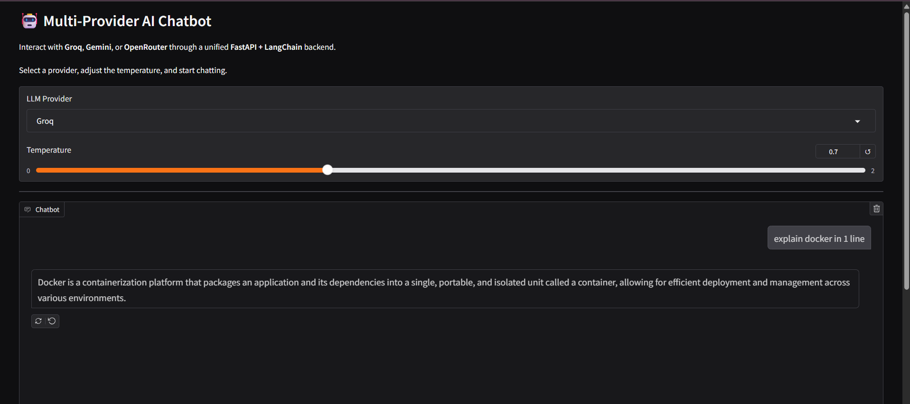

# Multi-Provider AI Chatbot UI


A lightweight Gradio frontend for interacting with multiple Large Language Models through a unified FastAPI backend.

## Features

- Multi-provider support (Groq, Gemini, OpenRouter)
- Adjustable temperature
- FastAPI-powered backend
- LangChain integration
- Live deployment on Render

## Live Demo

**Frontend:**  
https://<your-gradio-url>.onrender.com

**Backend API:**  
https://cli-multi-provider-ai-chatbot.onrender.com

**API Documentation:**  
https://cli-multi-provider-ai-chatbot.onrender.com/docs

## Tech Stack

- Gradio
- FastAPI
- LangChain
- Docker
- Render

## Run Locally

```bash
pip install -r requirements.txt
python app.py
```

## Project Structure

```
gradio_ui/
├── app.py
├── requirements.txt
└── README.md
```